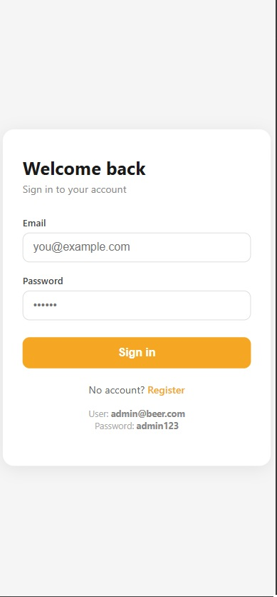
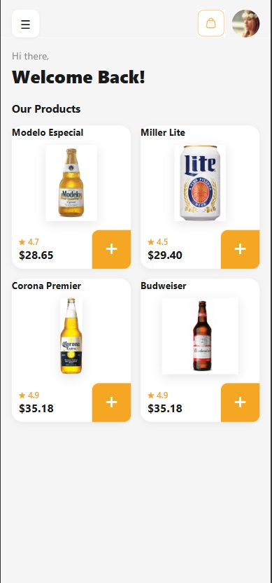
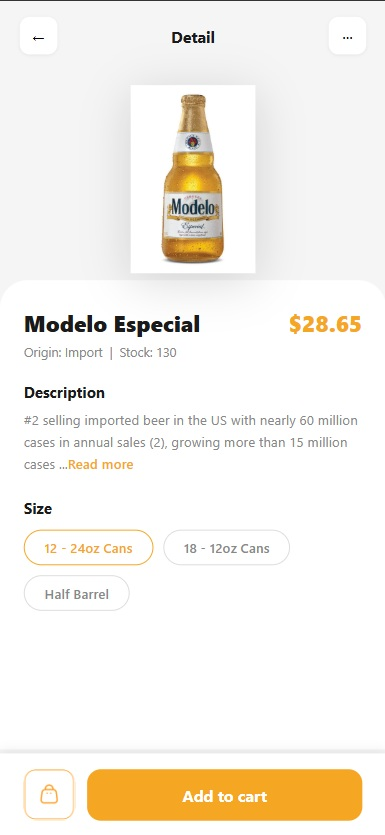
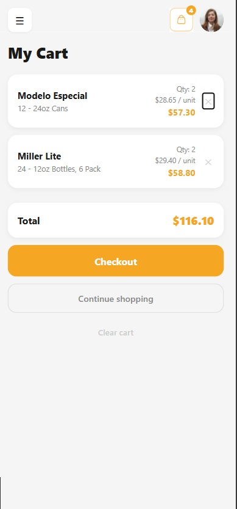

# Beer E-Commerce — Full Stack Challenge

A full-stack beer e-commerce application built as a technical challenge. Users can browse a product catalog, view real-time stock and pricing per variant, manage a shopping cart, and place orders.

---

## Screenshots

| Login | PLP | PDP | Cart |
|-------|-----|-----|------|
|  |  |  |  |

---

## Stack

| Layer | Tech |
|-------|------|
| Frontend | React 19, Vite 7, React Router 7 |
| Backend | Node.js, Express 5 |
| Auth | JWT (jsonwebtoken + bcryptjs) |
| Testing | Vitest + Testing Library (frontend), Jest (backend) |

JavaScript only — no TypeScript. ESModules throughout.

---

## Project Structure

```
chanllenge-minutentag/
├── backend/       # REST API — auth, products, stock, checkout
└── Front-end/     # React SPA — PLP, PDP, cart, auth pages
```

Each app has its own dependencies and README:

- [`backend/README.md`](./backend/README.md)
- [`Front-end/README.md`](./Front-end/README.md)

---

## How It Works

```
Browser → React SPA ──→ POST /api/auth/login     → JWT token
                    ──→ GET  /api/products        → product catalog
                    ──→ GET  /api/stock-price/:sku → stock + price (polled every 5s)
                    ──→ POST /api/checkout        → order confirmation
```

The frontend stores the JWT in `localStorage` and attaches it as a `Bearer` header on every request. Protected routes redirect unauthenticated users to `/login` automatically.

---

## Getting Started

### 1. Backend

```bash
cd backend
pnpm install
pnpm dev
```

Runs on `http://localhost:3001`. Seeded with 3 mock users on startup.

### 2. Frontend

```bash
cd Front-end
npm install
npm run dev
```

Runs on `http://localhost:5173`. Requires the backend to be running.

---

## Demo Credentials

| Email | Password |
|-------|----------|
| `admin@beer.com` | `admin123` |
| `john@beer.com` | `password123` |
| `jane@beer.com` | `beer1234` |

> Also shown as hints on the login page.

---

## Features

- **Authentication** — register and login with JWT. Token persisted in `localStorage`.
- **Product listing (PLP)** — browse the full beer catalog with prices.
- **Product detail (PDP)** — select variants, view stock and price refreshed every 5 seconds.
- **Shopping cart** — add and remove items, persisted across page refreshes.
- **Checkout** — stock validated server-side before any order is confirmed.
- **Protected routes** — unauthenticated users are redirected to `/login`.

---

## Running Tests

### Frontend

```bash
cd Front-end
npm run test:run
```

### Backend

```bash
cd backend
pnpm test:run
```

---

## Known Limitations

- **In-memory data** — all products, stock, and users are stored in memory. Everything resets on server restart.
- **No token refresh** — JWTs expire after 7 days with no renewal mechanism. The user is silently logged out.
- **No 401 interception** — expired tokens on protected API calls show a `window.alert` instead of redirecting to `/login` automatically.
- **Hardcoded ratings** — product ratings are static values on the frontend; the backend does not expose them.

---

## What I Would Add to Take This to Production

None of these are implemented yet — this section reflects what I'd prioritize to make this project production-ready.

### Infrastructure

- **Docker** *(not implemented)* — containerize both apps with a `Dockerfile` per service and a `docker-compose.yml` to orchestrate them locally and in CI.

```
chanllenge-minutentag/
├── backend/Dockerfile
├── Front-end/Dockerfile
└── docker-compose.yml
```

- **Environment variables** — inject secrets (`JWT_SECRET`, `VITE_API_URL`) via CI environment, never committed to the repo.

### CI/CD — CircleCI *(not implemented)*

Add a `.circleci/config.yml` pipeline with the following jobs:

```
install → lint → test → build → deploy
```

- Run frontend and backend tests in parallel jobs
- Block merges to `main` if any job fails
- Deploy automatically on merge to `main`

### Test Coverage — Coveralls *(not implemented)*

- Integrate Coveralls to track test coverage over time
- Add the coverage badge to this README
- Set a minimum threshold (e.g. 80%) that fails the CI build if not met

### Backend

- **Persistent database** — replace in-memory stores with PostgreSQL or SQLite
- **Refresh tokens** — issue short-lived access tokens + long-lived refresh tokens
- **Rate limiting** — protect `/api/auth` endpoints against brute-force attacks
- **Environment-based CORS** — restrict `Access-Control-Allow-Origin` to the frontend URL
- **HTTPS** — terminate TLS at the load balancer or reverse proxy (nginx)

### Frontend

- **Token expiry detection** — intercept 401 responses globally and redirect to `/login`
- **Loading skeletons** — replace "Loading..." text with shimmer placeholders
- **Toast notifications** — replace `window.alert()` with an in-app toast system
- **E2E tests** — add Playwright or Cypress for the full login → browse → checkout flow
